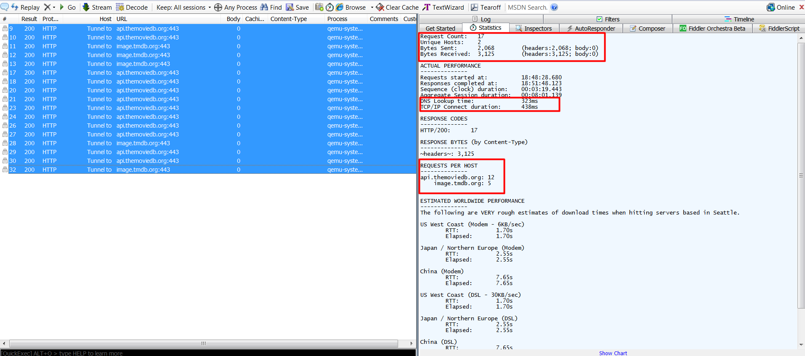

# QA Engineer Coding Challenge

Hello there and welcome to our coding challenge. Buckel up and enjoy the ride. 

## Rules
Before we start there are some rules of engagement:
1. Submissions must be formulated as GitHub merge requests
2. You can make smaller commits and MRs so that we can see the gradual progress
3. Please respect the given deadline

## Setup before starting
- create a GitHub Account if not having one already
- create a TMDB account https://www.themoviedb.org/documentation/api
- use a proxy tool, e.g. https://mitmproxy.org

## The Challenge

The challenge consits in:
1. Choose one of an already existing Android or iOS TMDB client Apps from these:

https://github.com/skydoves/TheMovies

https://github.com/alfianlosari/MovieInfoMVVMiOS

https://github.com/haroldadmin/MovieDB

https://github.com/IhwanID/belajar-android-jetpack-pro

2. Write automation tests based on the sample project you chose. Automations tests should include:
- going from main movies list screen to the details screen of the app
- filtering movies based on year or popularity

3. Cucumber UI features:
- based on the screens in the app write Cucumber features

4. Network tests
- use one of the tracing tools to trace the app network traffic
- simulate network velocity

# Solution

## 1. Project Setup

- Java 12
- Gherkin/Cucumber
- Appium
- Selenium 
- Build Tool : Maven 

## 2. Software needs to be Install

- Java
- Android sdk
- Appium
- IDE IntelliJ

## 3. Client App used for code challenge

https://github.com/IhwanID/belajar-android-jetpack-pro

## 4. High level Scenario designed for 

- Adding Movies and TV-Shows in favorite list (For details refer feature file)
- Verify content fields of Movies and TV-Shows detail page (For details refer feature file)

## 5. Reporting 

Result will be generated in Result folder
- Sample of Over all summary 

- Sample report for test cases level
 

## 6. Network Test

- Fiddler Fiddler tracing tools to trace the app network traffic with "full network upload and download speeds"

- Fiddler Fiddler tracing tools to trace the app network traffic with "GSM network upload and download speeds"

## 6. Open items 

Integration with project with Proxy
- tried with okHTTP with fiddler proxy need more understanding and time
** reference : https://developers.perfectomobile.com/pages/viewpage.action?pageId=41026106

- tried with mitmproxy blocked at level https://github.com/appium/mitmproxy-java/issues/4 
** blocked while installing mitmproxy with PIP command 

## 7. Findings

Started building automation for project https://github.com/haroldadmin/MovieDB but look like some problem with API because app is always in loading state 
